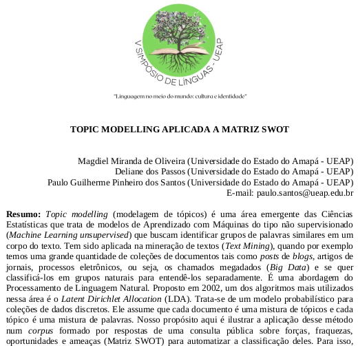
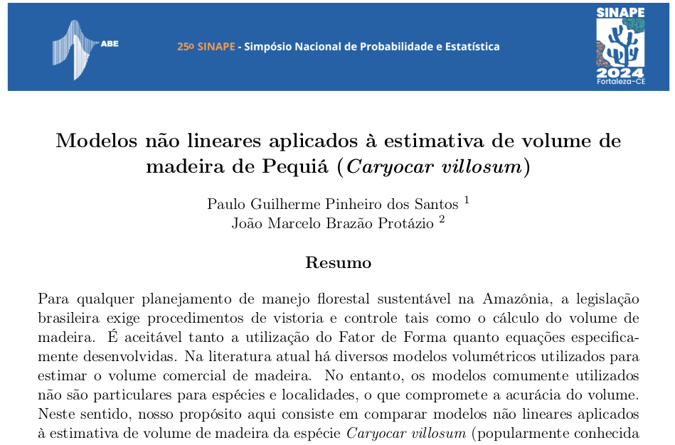
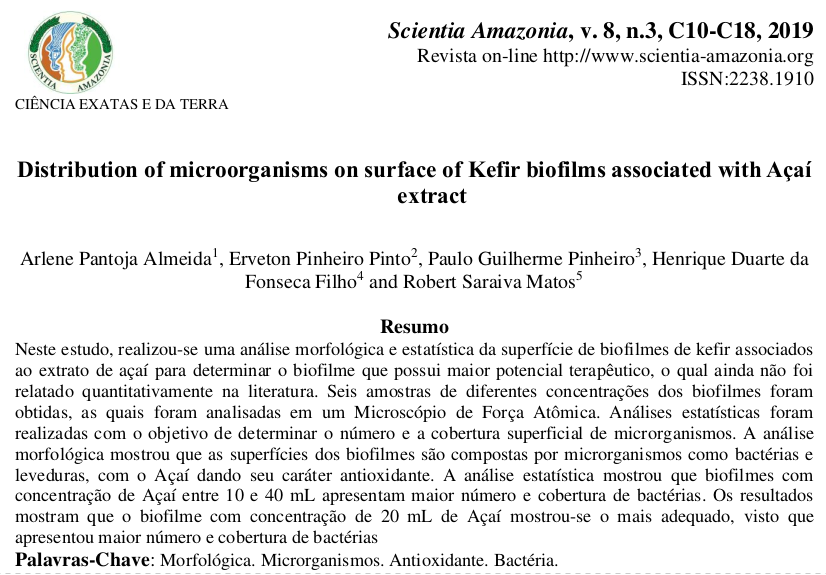
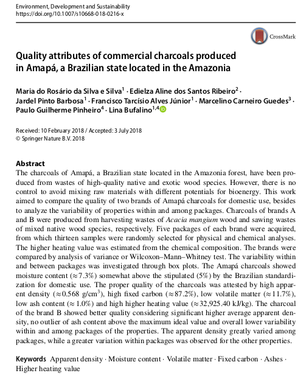
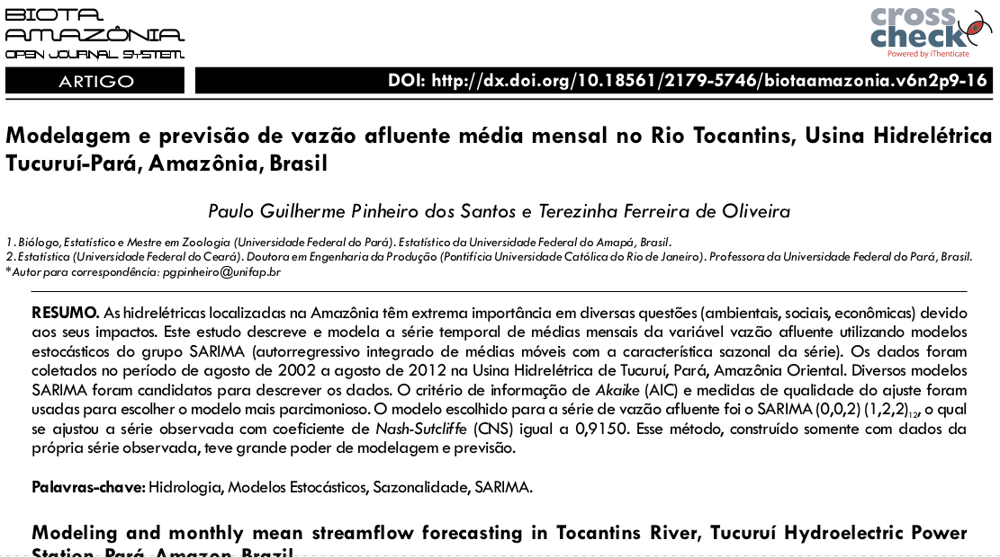
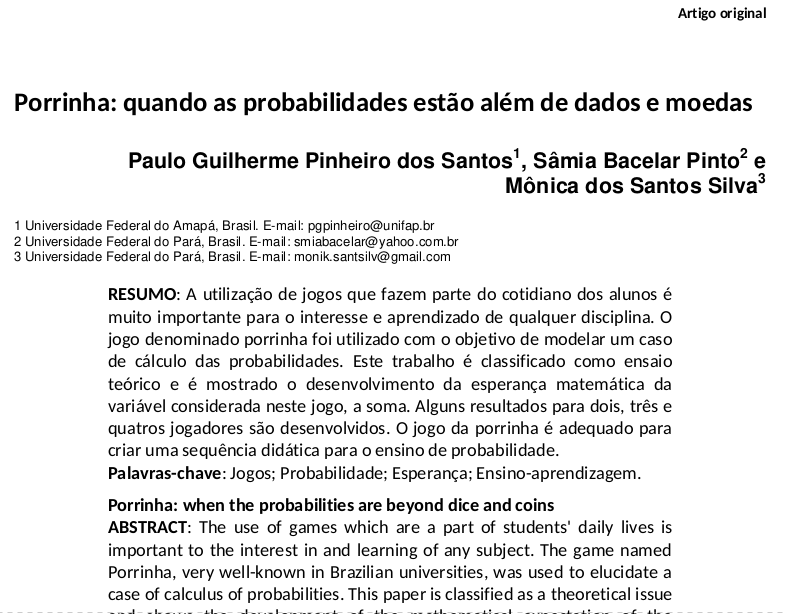

background-image: url(figs/qrcode_pgpinheiro2.github.io.png)

```{r setup, include=FALSE}
options(htmltools.dir.version = FALSE)
```

---
## CV resumido

.pull-left[
## Acadêmico
- Mestre em Estatística - FAEST/ICEN/UFPA;

- Bacharel em Estatística - PPGME/ICEN/UFPA;

- Mestre em Zoologia - PPGZOO/MPEG/ICB/UFPA;

- Bacharel em Ciências Biológicas - ICB/UFPA;
]

.pull-right[
## Profissional

- Professor - COLIMA/UEAP;

- Estatístico/Técnico-Administrativo em Educação - UNIFAP;

- Projeto Oficina do Vestibulando;

- Auxiliar de Campo - IPAM;
]

---
# Meus interesses atuais

.pull-left[
## Probabilidade & Estatística Aplicada
- Meio Ambiente;
    - Modelos Não-Lineares
    
- Karate (Artes Marciais, Esporte);

- Ciência de Dados;
    - Dados não estruturados (Textos, Sons,...);
    
- Probabilidade e Estatística no ENEM (Projeto de Extensão);

]

.pull-right[
## Programação Estatística
- Programação em ;

- Pesquisa reproduzível, Documentos dinâmicos,...

- Git e GitHub;
    - Exemplo: [Clique aqui!](https://github.com/pgpinheiro2/pesquisa_pg)

- Painéis Estatísticos: [*Dashboards*](https://estatisticas-unifap.shinyapps.io/app1/), 

]

---
background-image: url(figs//artigos.png)
background-size: 65%
background-position: 90% 60%
## Alguns trabalhos publicados.


---
class: right
## O que já fiz?
- Estatística aplicada a um *corpus*: *Topic modelling*

```{r, echo = FALSE, fig.align='center', out.width="70%"}

```


---
class: right
## O que já fiz?

- Estatística aplicada a volume de madeira: Regressão Não Linear.
```{r, echo = FALSE, fig.align='center', out.width="70%"}

```

---
class: right
## O que já fiz?

- Estatística aplicada a biofilmes de açaí: Regressão.

```{r, echo = FALSE, fig.align='center', out.width="70%"}

```

---
class: right
## O que já fiz?

- Estatística aplicada a qualidade de carvão: Testes de hipóteses.

```{r, echo = FALSE, fig.align='center', out.width="70%"}

```

---
class: right
## O que já fiz?

- Séries temporais aplicada a vazão no Rio Tocantins, PA: SARIMA.

```{r, echo = FALSE, fig.align='center', out.width="90%"}

```

---
class: right
## O que já fiz?

- Probabilidade aplicada a jogos.

```{r, echo = FALSE, fig.align='center', out.width="85%"}

```


---
class: right, inverse
background-image: url(https://upload.wikimedia.org/wikipedia/pt/b/be/Bras%C3%A3o_UEAP.png)
background-size: 25%
background-position: 10% 15%
# Contatos

Paulo Guilherme P. dos Santos

Colegiado do Curso de Lic. em Matemática - COLIMA

Campus I - Av. Presidente Vargas, nº 650

Centro | CEP: 68.900-070

Macapá - AP 

*e-mail*: [paulo.santos@ueap.edu.br](mailto: paulo.santos@ueap.edu.br)

CLattes: [http://lattes.cnpq.br/0539600993405515](http://lattes.cnpq.br/0539600993405515)